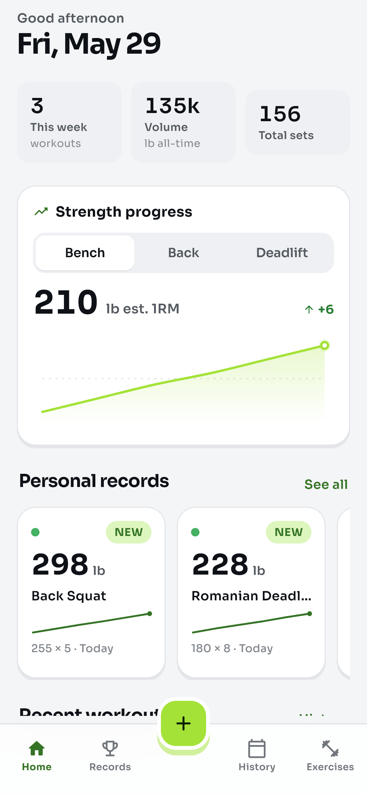

# Arc — Gym Progress Tracker

A Flutter app for **Android** and **Web** implementing the **B · Surge** design
direction: _Bold athletic · volt_. Light UI, tight athletic corners, the Sora
typeface, and a signature volt (lime) accent.



## Features

- **Dashboard** — greeting + date, week stats (workouts / volume / total sets),
  an interactive **strength-progress** chart (Bench / Back / Deadlift), a
  horizontally-scrolling **Personal Records** rail, and recent workouts.
- **Records** — all lifts ranked by estimated 1RM, filterable by muscle group,
  each with a sparkline and a tap-through detail sheet.
- **History** — a month calendar with workout days dotted by muscle group
  (Push / Pull / Legs), today ringed in volt, and monthly volume stats.
- **Exercises** — the exercise library with per-exercise training counts and
  bests; add your own.
- **Log workout** — a full sheet with a date picker, per-set weight/rep steppers,
  add/remove sets and exercises, search, and inline new-exercise creation.
  Saving detects **new PRs** and surfaces a toast.
- **PR detail** — hero 1RM, trend chart, top weight / sessions / total reps, and
  a full progression log.

All metrics (estimated 1RM, session volume, records, streak/week stats) and the
6-week / 18-session seed history are ported from the original design's data
model. The "today" date is pinned to **Fri, May 29 2026** to match the seed.

## Architecture

```
lib/
  main.dart                 App root + ChangeNotifierProvider
  theme/app_theme.dart      Surge palette (OKLCH→sRGB), radii, shadows, Sora type
  data/
    models.dart             Exercise, WorkoutSet, Entry, Session, records
    arc_data.dart           Seed data, metrics, date helpers (port of arc-data.js)
    store.dart              ArcStore (ChangeNotifier) + toast channel
  widgets/
    arc_icons.dart          Icon-name → Material rounded glyph mapping
    ui.dart                 Card, StatTile, Segmented, ArcStepper, ArcButton, Tag…
    charts.dart             LineChart, Spark, Bars (CustomPainter)
    sheet.dart              Arc-styled bottom-sheet scaffold
  screens/                  Dashboard, Records, Calendar, Library, HomeShell
  sheets/                   PR detail, Day detail, Log workout, Add exercise
assets/fonts/Sora.ttf       Bundled variable font (offline; wght axis driven directly)
```

State is held in a single `ArcStore` (provided above `MaterialApp`, so modal
sheets can read it). Charts are hand-painted; there are no charting dependencies.

## Running

```bash
flutter pub get

# Web
flutter run -d chrome

# Android (device/emulator attached)
flutter run -d android

# Builds
flutter build web
flutter build apk
```

## Tooling

- `flutter analyze` — clean.
- `flutter test` — boots the app to the dashboard (smoke test).
- `screenshots/` holds reference renders of each screen.

## Design source

The original interactive design lives in `arc_design/` (extracted from
`arc.zip`). Direction **B · Surge** from that file is what this app implements.
